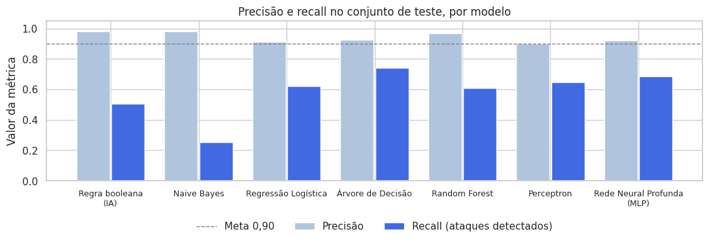

# Trabalho 3 · SSD para Detecção de Intrusões em Redes com IA, Machine Learning e Deep Learning

**Universidade de Brasília · Departamento de Engenharia de Produção**
Disciplina: Sistemas de Suporte à Decisão · Prof. André Luiz Marques Serrano
Aluna: Giovanna Santiago · Tema: Segurança cibernética


---

## 1. Objetivo

Um centro de operações de segurança (SOC) recebe milhares de conexões de rede por minuto e não consegue inspecionar uma a uma. Regras fixas de IDS deixam passar ataques novos. Este MVP constrói um **Sistema de Suporte à Decisão** que classifica cada conexão como normal ou ataque, explica o que pesou na decisão e **recomenda uma ação** (bloquear, investigar ou liberar), considerando que deixar passar um ataque custa muito mais do que investigar um alarme falso.

O trabalho percorre os três níveis vistos em aula, no mesmo problema:

| Nível | Técnica usada |
|---|---|
| IA simbólica | Regra booleana escrita à mão (SE ... E ... OU ... ENTÃO ataque) |
| Machine Learning | Naive Bayes, Regressão Logística, Árvore de Decisão, Random Forest |
| Deep Learning | Perceptron e rede neural profunda (MLP) em TensorFlow/Keras |

**Hipótese:** um modelo treinado supera a regra manual, e uma rede neural profunda generaliza melhor para tipos de ataque que não existiam no treino.

### Perguntas de negócio

| # | Pergunta | Decisão apoiada |
|---|---|---|
| P1 | Quais categorias de ataque são mais frequentes e quais protocolos e serviços são mais visados? | Onde concentrar monitoramento |
| P2 | Modelos de ML detectam ataques em tráfego novo com recall ≥ 90% e precisão ≥ 90%, superando a regra booleana? | Trocar regras fixas por modelo? |
| P3 | Uma rede neural profunda supera o ML clássico, especialmente nos ataques nunca vistos no treino? | Vale a complexidade do DL? |
| P4 | Quais características da conexão mais pesam na detecção? | O que o analista olha primeiro; quais logs coletar |
| P5 | Qual limiar minimiza o custo esperado se um ataque não detectado custa 10 vezes um alarme falso? | Política de ação |

## 2. Dados

| Item | Descrição |
|---|---|
| Base | NSL-KDD (Canadian Institute for Cybersecurity, University of New Brunswick) |
| Arquivos | `KDDTrain+.txt` (125.973 conexões) e `KDDTest+.txt` (22.544 conexões, com 17 tipos de ataque ausentes no treino) |
| Formato | CSV sem cabeçalho, 41 atributos + rótulo + dificuldade |
| Fonte da coleta | Espelho público: `github.com/defcom17/NSL_KDD` |
| Licença | Uso acadêmico, com citação de Tavallaee et al. (2009). **Os dados brutos não são versionados**: o notebook baixa da fonte |
| LGPD | Sem dados pessoais (sem IPs ou identificadores); tráfego simulado em laboratório |

A escolha foi feita por busca booleana, por exemplo `("intrusion detection" OR "IDS") AND ("dataset") AND ("labeled")`, comparando NSL-KDD, KDD Cup 99, CIC-IDS2017 e UNSW-NB15 (critérios no notebook, seção 3).

## 3. Pipeline

```
Coleta (URL)  →  bronze/ (CSV bruto)  →  ETL  →  silver/ (tb_conexoes.parquet + catálogo)  →  Modelos  →  gold/ (métricas, política, modelo .keras)
```

* **Plataforma:** Google Colab, com persistência no Google Drive (`MyDrive/MVP_SSD_Seguranca/`), organizado em camadas bronze, silver e gold.
* **Modelo de dados:** flat (Data Lake), uma linha por conexão (`tb_conexoes`).
* **Catálogo de Dados:** [`catalogo/catalogo_dados.csv`](catalogo/catalogo_dados.csv), com tipo, descrição, domínio (mín./máx. ou categorias), obrigatoriedade e linhagem de cada um dos 47 atributos.
* **Regras de transformação:** categoria do ataque (DoS, Probe, R2L, U2R); alvo binário; marcação de ataque novo; remoção de `num_outbound_cmds` (constante); `log(1+x)` em bytes e duração; `difficulty` excluída das variáveis explicativas (evita vazamento).
* **Evidência de persistência na nuvem:** o notebook foi executado no Google Colab com o Google Drive montado ([print](evidencias/15_colab_drive_montado.png)), e as três camadas foram gravadas em `Meu Drive > MVP_SSD_Seguranca` ([camadas](evidencias/11_drive_camadas.png)):
  * bronze: `KDDTrain+.csv` (16,8 MB) e `KDDTest+.csv` (3 MB) ([print](evidencias/12_drive_bronze.png))
  * silver: `tb_conexoes.parquet` (3,7 MB) e `catalogo_dados.csv` (8 KB) ([print](evidencias/13_drive_silver.png))
  * gold: métricas, detecção por categoria, limiar ótimo, política de ação e o modelo `modelo_mlp.keras` (349 KB) ([print](evidencias/14_drive_gold.png))
* **Qualidade:** sem nulos, sem duplicatas, sem valores fora do domínio, sem contradições entre atributos; uma coluna constante removida; `su_attempted` assume valor 2 apesar de documentado como 0/1.

## 4. Resultados

### Desempenho no teste (limiar padrão 0,5)

Valores da execução no Colab ([print](evidencias/16_colab_tabela_modelos.png)).

| Modelo | Nível | Precisão | Recall | F1 | AUC |
|---|---|---|---|---|---|
| Regra booleana | IA | 0,981 | 0,507 | 0,669 | · |
| Naive Bayes | ML | 0,980 | 0,252 | 0,400 | 0,797 |
| Regressão Logística | ML | 0,914 | 0,621 | 0,739 | 0,785 |
| **Árvore de Decisão** | ML | 0,925 | **0,739** | **0,822** | 0,830 |
| Random Forest | ML | 0,968 | 0,610 | 0,748 | **0,957** |
| Perceptron | DL | 0,899 | 0,646 | 0,751 | 0,722 |
| Rede Neural Profunda (MLP) | DL | 0,923 | 0,688 | 0,788 | 0,914 |



Na validação (mesma distribuição do treino) quase todos os modelos passam de 97% de F1, e a validação cruzada com 5 dobras confirma estabilidade (desvio ≤ 0,004). No teste, o F1 cai de 18 a 42 pontos: é **mudança de distribuição**, não overfitting clássico (as curvas de treino e validação da rede andam juntas, ver [evidência](evidencias/05_curvas_rede_neural.png)).

### Respostas

| # | Resposta |
|---|---|
| P1 | DoS domina (78% dos ataques no treino, 58% no teste), concentrado no serviço `private` e com flag S0 (SYN flood). 85% das conexões ICMP são ataque. No teste, R2L sobe de 1,7% para 21,5% dos ataques. [Evidência](evidencias/02_categorias_e_servicos.png) |
| P2 | **Parcialmente.** No limiar 0,5 nenhum modelo atinge a meta; todos os de ML, exceto Naive Bayes, superam a regra. Com limiar ajustado por custo, o Random Forest chega a recall 0,980 e precisão 0,892. |
| P3 | **Não.** A MLP não supera a Árvore de Decisão: F1 no teste de 0,788 contra 0,822; repetindo com sementes diferentes, cerca de 0,79 contra 0,80, e cerca de 42% contra 50% dos ataques de tipos novos detectados. Hipótese refutada para esta base. [Evidência](evidencias/08_deteccao_por_categoria.png) |
| P4 | Bytes enviados e recebidos, flag SF e taxas de repetição de serviço são os atributos mais importantes. [Evidência](evidencias/09_importancia_variaveis.png) |
| P5 | Limiar ótimo do Random Forest = 0,01 (basta 1 de 100 árvores votar "ataque"): custo total cai 92% em relação ao limiar 0,5, com a mesma conclusão para custos de 5 a 20. [Evidência](evidencias/10_custo_por_limiar.png) |

### Recomendação do SSD (Random Forest, metade de avaliação do teste)

| Ação | % das conexões | % que são ataque | % de todos os ataques |
|---|---|---|---|
| 🔴 BLOQUEAR (prob. ≥ 0,90) | 30,1% | 96,9% | 51,2% |
| 🟡 INVESTIGAR (0,01 ≤ prob. < 0,90) | 32,5% | 82,0% | 46,8% |
| 🟢 LIBERAR (prob. < 0,01) | 37,4% | 3,1% | 2,0% |

Metade dos ataques é bloqueada automaticamente com quase nenhum alarme falso, a fila do analista tem 4 ataques reais a cada 5 itens, e só 2% dos ataques escapam.

## 5. Autoavaliação

* **Atingimento:** P1, P4 e P5 respondidas; P2 parcialmente (precisão 0,8 ponto abaixo da meta após ajuste do limiar); P3 respondida com resultado negativo.
* **Limitações dos dados:** tráfego de laboratório de 1998; apenas 52 exemplos U2R no treino; 54 conexões `snmpgetattack` idênticas a conexões normais; calibração do limiar feita com metade do teste; custo 10:1 é premissa (testada entre 5 e 20).
* **Faria diferente:** pesos de classe e *embedding* para `service` na rede neural; calibração com base temporal separada; validação em CIC-IDS2017 ou UNSW-NB15.
* **Para uso contínuo:** retreino periódico com os casos confirmados pelos analistas; *autoencoder* para detectar anomalias sem rótulo; pipeline agendado com painel das três faixas; explicação por alerta (SHAP).

## 6. Como reproduzir

1. Abra `notebooks/SSD_Trab3_Seguranca_Cibernetica_IA_DL.ipynb` no Google Colab (Arquivo > Fazer upload de notebook, ou pelo GitHub).
2. Execute *Ambiente de execução > Executar tudo*. Autorize o acesso ao Google Drive quando solicitado.
3. Os dados são baixados automaticamente e salvos em `MyDrive/MVP_SSD_Seguranca/` (bronze, silver e gold). Tempo total: cerca de 5 minutos.

## 7. Estrutura do repositório

| Caminho | Conteúdo |
|---|---|
| `README.md` | Este documento |
| `notebooks/` | Notebook completo, executado, com coleta, ETL, qualidade, modelos e análise |
| `catalogo/` | Catálogo de Dados |
| `evidencias/` | Gráficos e tabelas de resultado (camada gold) |
| `LICENSE` | Licença do código e registro da licença dos dados |

## Referências

* TAVALLAEE, M. et al. *A Detailed Analysis of the KDD CUP 99 Data Set*. IEEE CISDA, 2009.
* Canadian Institute for Cybersecurity. NSL-KDD. https://www.unb.ca/cic/datasets/nsl.html
* SERRANO, A. L. M. *Demonstração de implementações de Inteligência Artificial com Deep Learning* (notebook de aula), UnB, 2026.
